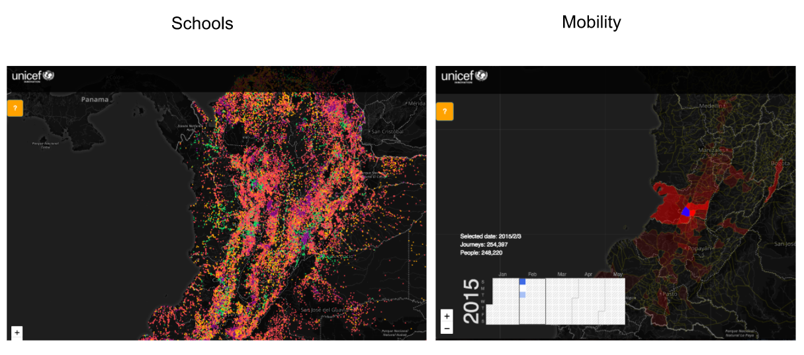

magicbox-maps
=============

[](https://opensource.org/licenses/BSD-3-Clause)
[](https://gitter.im/unicef-innovation-dev/Lobby)
[](https://travis-ci.org/unicef/magicbox-maps)
[](https://codeclimate.com/github/unicef/magicbox-maps/maintainability)

Map mobility data in a NodeJS + React front-end application with data served by
magicbox-open-api



## What is it?

magicbox-maps is a [React](https://reactjs.org/) front-end application that
serves data from the
[magicbox-open-api](https://github.com/unicef/magicbox-open-api). magicbox-maps
works with different types of data sets, so you can show relationships between
different data sets in a geographic map. These data sets include school location
and other key attributes as well as information on school Internet connectivity,
both in terms of speed (Mbs) and type (2G and 3G). <!-- Is this publicly
available data??? -->

magicbox-maps uses WebGL and a component of React to render plot points across
[OpenStreetMap leaflets](http://leafletjs.com/). The countries displayed are
organized by [geospatial shapefiles](https://en.wikipedia.org/wiki/Shapefile),
provided by various sources, like [GADM](http://gadm.org/).

### How we use it

The UNICEF Office of Innovation uses magicbox-maps for two purposes:

1. Mapping schools globally
   ([demo](http://school-mapping-development.azurewebsites.net/))
2. Mapping mobility of people globally
   ([demo](http://magicbox-maps-development.azurewebsites.net/))

Mapping schools helps us understand… <!-- What are we trying to understand and
do with school mappings? Why do they matter? -->

Mapping mobility of people helps us understand movement patterns. In the case of
disease outbreak (e.g. Zika, Dengue fever, cholera, etc.), mobility data helps
countries develop deeper insights to disease prevention and response with
vaccination campaigns or moving response resources into place. For sudden, mass
movement of people (e.g. refugee crisis), mobility data helps local governments
anticipate an influx of people in advance and to respond appropriately with
relief resources.


## Installation

This section documents a development environment, not a production instance.
Please reach out to [@UNICEFinnovate on
Twitter](https://twitter.com/UNICEFinnovate) for more information about using
MagicBox in production.

### Requirements

* Nodejs 8.x.x
* Running instance of
  [magicbox-open-api](https://github.com/unicef/magicbox-open-api)


### Installation

**Clone repo, copy sample config**:

```bash
git clone https://github.com/unicef/magicbox-maps.git
cd magicbox-maps/
cp react-app/src/config-sample.js react-app/src/config.js
```

**Install dependencies for server back-end**:

```bash
cd server/
npm install
```

**Install dependencies for React front-end**:

```bash
cd .. // go back to the root directory if needed
cd react-app/
npm install
```

### Configuration

The configuration file goes in `react-app/src/config.js`. A [sample
config](https://github.com/unicef/magicbox-maps/blob/master/react-app/src/config-sample.js)
is included (see below).

```javascript
module.exports = {
  countries_with_school_connectivity: process.env.countries_with_school_connectivity || '{"COL": 1, "BRA": 1, "MRT": 1}',

  // 'schools' or 'mobility'
  mode: process.env.REACT_APP_MODE || 'mobility',

  // Email contact info for map types
  email_contact_mobility: process.env.email_contact_mobility || '',
  email_contact_schools: process.env.email_contact_schools || '',

  // Endpoints configured for magicbox-open-api by default
  initial_url_key: {
    mobility: process.env.REACT_APP_MOBILITY_ENDPOINT || 'mobility',
    schools: process.env.REACT_APP_SCHOOLS_ENDPOINT || 'schools'
  },

  // Require login?
  login_required: (process.env.REACT_APP_LOGIN_REQUIRED==='true'),

  // Address of magicbox-open-api back-end
  magicbox_url: process.env.MAGICBOX_URL || 'MAGICBOX_API_URL',

  // Tokens needed to access private data (e.g. school mappings)
  rfUrl: process.env.RF_URL || 'REFRESH_TOKEN_URL',
  refreshToken: process.env.REFRESH_TOKEN || 'REFRESH_TOKEN'
}
```

### Usage

magicbox-maps only works if a valid magicbox-open-api instance is running. See
how to set it up [in the API
README](https://github.com/unicef/magicbox-open-api).

The magicbox-maps back-end server and front-end React application must be
running at the same time.

**Run the server**:

```bash
cd magicbox-maps/server
npm start
```

**Run the front-end**:

```bash
cd magicbox-maps/react-app
npm start
```

## Contributing

Interested in contributing? Read our [contribution
guidelines](https://github.com/unicef/magicbox-maps/tree/master/.github/CONTRIBUTING.md)
for help on getting started.

Our team tries to review new contributions and issues on a weekly basis. Expect
a response on new pull requests **within five business days** (Mon-Fri). If you
don't receive any feedback, please follow up with a new comment!


## Legal

[](https://opensource.org/licenses/BSD-3-Clause)

This project is licensed under the [BSD 3-Clause
License](https://opensource.org/licenses/BSD-3-Clause).
